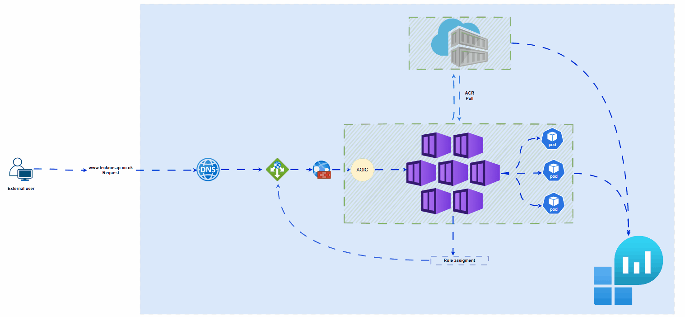
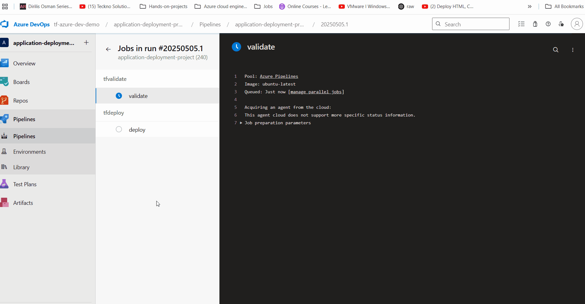
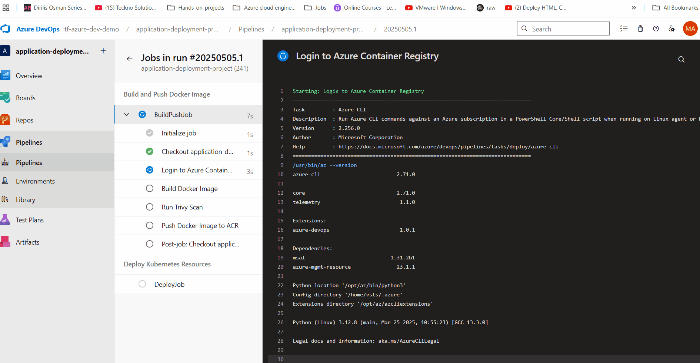
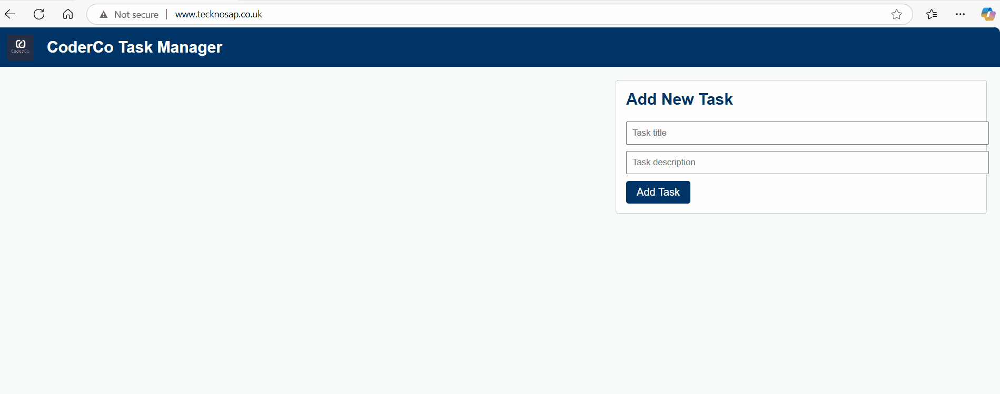

# 🚀 **Optimised Enterprise-Grade Application Deployment on Azure | Terraform, Docker, Kubernetes (AKS), CI/CD**

## 📌 **Overview**  
This project automates the deployment of an open-source application on **Azure** using **Terraform** and **Azure DevOps CI/CD pipelines**. It provisions **Azure Kubernetes Service (AKS)** or **Azure Container Apps**, **Azure Container Registry (ACR)**, **Azure Application Gateway**, and supporting infrastructure to ensure **scalability, security, and efficiency**.

<!-- 🔹 **When Live the Site will show here**: [www.tecknosap.co.uk](http://www.tecknosap.co.uk) -->

---

## 🏗 **Key Components**  
| Component | Description |
|-----------|------------|
| **Azure Container Registry (ACR)** | Stores Docker images for deployment |
| **Azure Kubernetes Service (AKS)   | Hosts the containerized application |
| **Azure Application Gateway**      | Routes and manages HTTPS traffic |
| **Terraform**                      | Automates infrastructure provisioning |
| **Azure DevOps CI/CD**             | Builds, tests, and deploys the application |

---

## 📂 **Project Structure**  
```plaintext

application-deployment-project/
│
├── teckno/                        # Contains all infrastructure, app code, and configuration
│   ├── app/                       # Application source code
│   ├── assets/                    # GIFs and images for documentation
│   ├── docker/                    # Docker-related files (e.g., Dockerfile, scripts)
│   ├── infra/                     # Terraform modules and infra configuration
│   ├── kubernetes/                # Kubernetes manifests (deployment, service, ingress)
│   ├── pipelines/                 # Azure DevOps CI/CD pipeline YAMLs
│   │   ├── application-deploy.yml
│   │   └── infra-deploy.yml
│   ├── .gitignore                 # Git ignore rules
│   ├── .terraform.lock.hcl        # Provider lock file (no secrets; safe for source control)
│   ├── backend.tf                 # Terraform backend configuration
│   ├── main.tf                    # Main Terraform configuration
│   ├── variables.tf               # Terraform variable definitions
│   └── README.md                  # Project documentation


````

## 🔧 Technologies Used

✅ Azure: AKS, ACR, Application Gateway, DNS, VNET / Log analytics and Role assignment

✅ Terraform: Infrastructure as Code (IaC) automation

✅ Docker: Containerization of the application

✅ Kubernetes / Azure Container Apps: Orchestration of containers

✅ Azure DevOps: Continuous Integration & Deployment (CI/CD)

✅ Checkov: Static analysis tool used to scan and check Terraform code for security and compliance issues

✅ Trivy: Container image scanning tool used to identify vulnerabilities in the Docker images before deployment

## 🚀 Deployment Workflow
1️⃣ Infrastructure Deployment (infra-deploy.yml)
This pipeline provisions Azure resources using Terraform. It creates:
- Azure Kubernetes Service (AKS)
- Azure Container Registry (ACR)
- Application Gateway
- Networking components
- DNS
- Role Assigment

  Security Step: The Terraform code is scanned using Checkov to identify any misconfigurations or security vulnerabilities before the infrastructure is deployed.

✅ Run infra-deploy.yml first to prepare the infrastructure.


2️⃣ Application Deployment (application-deploy.yml)
Once the infrastructure is provisioned, this pipeline:
- Builds the Docker image
- Pushes it to ACR
- Deploys the application to AKS

  Security Step: The Docker image is scanned using Trivy to detect any vulnerabilities before deployment.

✅ Run application-deploy.yml after infra-deploy.yml completes.

## Final Deployment Steps
git clone https://dev.azure.com/[your-organization]/[your-repository]
cd application-deployment-project
# Step 1: Deploy Infrastructure
Run infra-deploy.yml to provision resources in Azure.

# Step 2: Deploy Application
Run application-deploy.yml to dockerize the application and deploy it to AKS.

📌 Ensure infra-deploy.yml is executed first before deploying the application!

## 🌍 Architecture Diagram


### 📷 Deployment videos  
**Deploying infra deployment pipeline**  


**Deploying application deployment pipeline**  


### 📷 Live Site Screenshots



### 🏁 Conclusion
This project streamlines infrastructure provisioning and application deployment using Terraform, Azure DevOps, and Azure Kubernetes Service (AKS). The automated pipeline ensures scalability, security, and efficiency in deployment. The integration of Checkov for Terraform security scanning and Trivy for container image vulnerability scanning adds an extra layer of security, ensuring that both the infrastructure and application are robust and secure before deployment.

📜 License
Licensed under MIT License.

